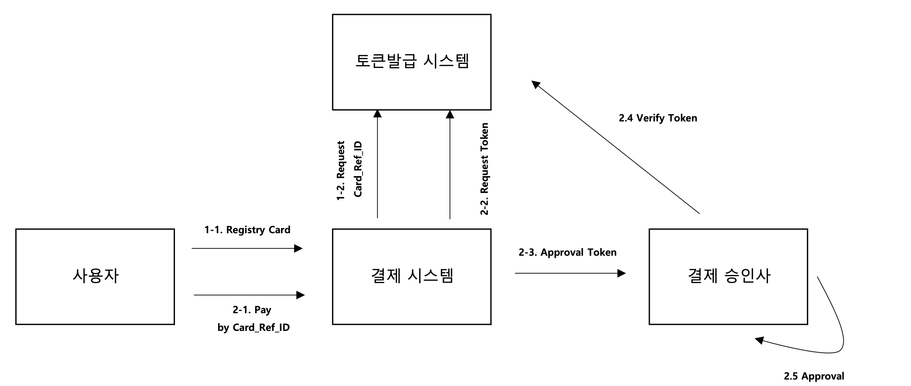
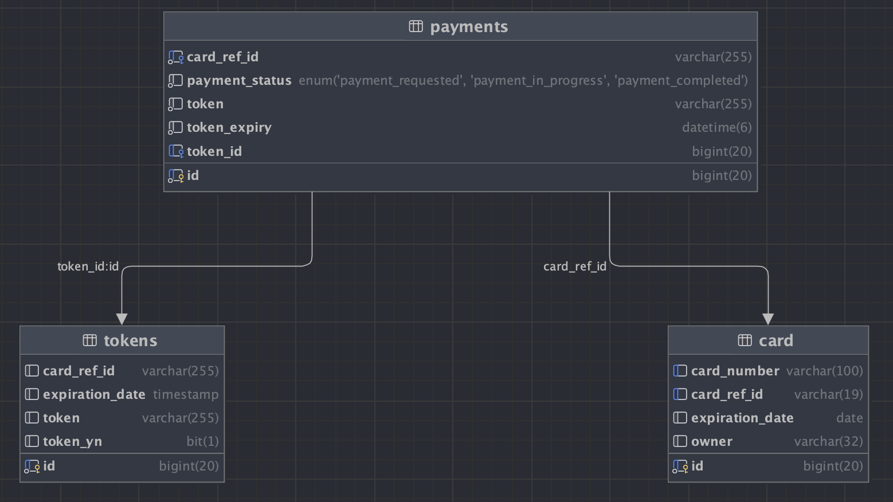
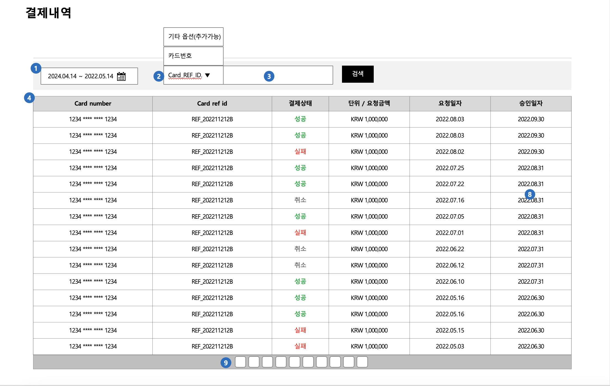

## 과제:

### 요구사항:
토근기반 결제 시스템 개발
1회용 토큰 기반 결제시스템을 구축하려 한다.
전체 과업은 결제 카드 등록 단계와 실제 결제 단계로 나뉜다.
결제 카드 등록 단계에서는, 고객의 신용카드 정보를 받아 별도 시스템(토큰 발급 시스템)에 등록하고, 그 결과로 카드 참조값(REF_ID)을 받아온다
실제 결제 단계에서는, 해당 카드 참조값을 이용해 토큰 발급 시스템에 1회용 토큰을 발급 받은 후, 해당 토큰으로 결제 승인 시스템과 통신해 결제를 처리한다.
이때, 결제 승인 시스템에서는 토큰 발급 시스템에 질의해 토큰의 유효성을 체크한 후 결제 승인을 최종적으로 마무리하는 과정을 거친다.



### 업무 요구사항
1. 사용자의 CI는 이미 습득을 했으며 사용자 식별키로 CI를 사용한다.
2. 카드정보는 결제시스템에서 볼 수 없으며 암호화하여 토큰발급 시스템에 저장한다.
3. 결제단계에서는 카드정보 개신 카드 참조값으로 결제를 진행해야 한다.
4. 모든 거래는 rest API 기반으로 설계한다.
5. 제시된 내용외에 프로세스 완성도를 위한 필요한 요소는 추가가 가능하다.
### 개발 요구사항
1. 언어는 JAVA(JDK17)를 사용한다.
2. 개발 프레임웍은 스프링을 활용한다.
3. DB는 H2를 활용한다(필요시 다른 DB사용 가능)
### 제출 사항
1. ERD
2. 소스
3. 데모 (필요시 노트북 지참)
4. 백오피스 UI 설계서(거래조회 화면만)

### 결과물 

### ERD 캐처화면


### 결제요청내역 UI 설계서 



## 기술스택
java version : Java17
Springboot 3.2.5
ORM : Spring-data-jpa
Database : mariadb (or Mysql 5.7)
NOSQL : redis 7.2.4
암호화 방식 : AES_ALGORITHM (양방향).

## 요구사항 구현에서 적용된 핵심 포인트 

 - 카드번호 생성 규칙 : 0~9 까지 (16자리 숫자).
 - card_ref_id 생성 규칙 : "ref_" + 19자라 UUID 으로 조합.
 - token 생성 규칙 : 대문자+소문자+숫자 무작위 램덤 생성.
 - Token 은 유효성 검증 : token 사용 여부( 토큰 1회만 사용 가능) + token 의 유효 시간은 1분.

 - RestFul api reponse 는 모두 ApiResponse<T> 객체를 공통 사용.
 - 모든 상태값 status 는 enum 클래스 관리.

 - 결제요청 api 중복요청 이슈 해결 : redis 를 사용한 key 값 , 1초 후 자동 소멸됨.
 - card number 암호화 : 위에 언급한 AES 양방향 암호화를 적용.
 - DI 주입방식은 : 필드주입방식 아닌 생성자 주입방식 사용.
 - JPA 의 Specification 를 사용하여 WHERE  의 AND 조건을 검색할수 있도록 개발.
 - log 폴더생성 경로는 아래 설정 참고 : widows , macos 각자 맞는 환경에 맞춰서 적용해야.
```yaml
logging:
  file:
    path: ./logs/local-dev
```
 - project 처음 기동시 database 만 만들고 ,아래 항목으로 `create` 로 설정. 두번째 기동시 `update`변경하여 기동해야 됨.
```yaml
  jpa:
    hibernate:
      ddl-auto: create #create #create-drop #update
```
